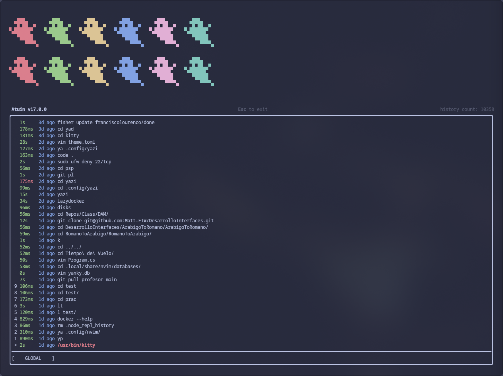

 

# :herb: ‎ <samp>About</samp>

Atuin is such a cool tool. It lets you easily **sync** all your shell history across multiple devices. I was looking for something like this for a while, and I'm glad I found it.

After the installation, you have to create a user with a password and save the key that will be given to you. Then you use that key and user on the other PC to sync their history together.

# :gear: ‎ <samp>Config</samp>

Atuin works at the start of a session with the shell you have.

The base configuration found here can be used regardless of the shell you have `:)`

I have Atuin configured to work with the fish shell, as it is the one I use on a daily basis. If you want to know how to change it, take a look at the **official [Atuin Configuration Guide](https://atuin.sh/docs/config/)**.

Aside from that, I have configured Atuin to replace the up-arrow history of Fish with a fuzzy search included in Atuin itself.
I also changed the frequency at which Atuin syncs its history with the server; it basically syncs every time you execute a command (**dont worry**, it will not slow down your shell).

# :camera: ‎ <samp>Gallery</samp>

